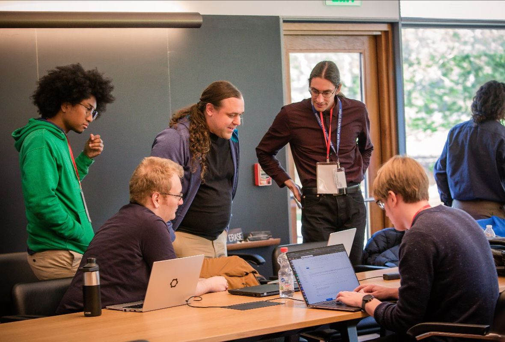

I was invited to give a talk about inference with semi-analytic models. The organisation comitteee defined semi-analytic models as anything that is effectively simpler than GRMHD.
I showed some preliminary results from a paper that I planned to publish later that year.

